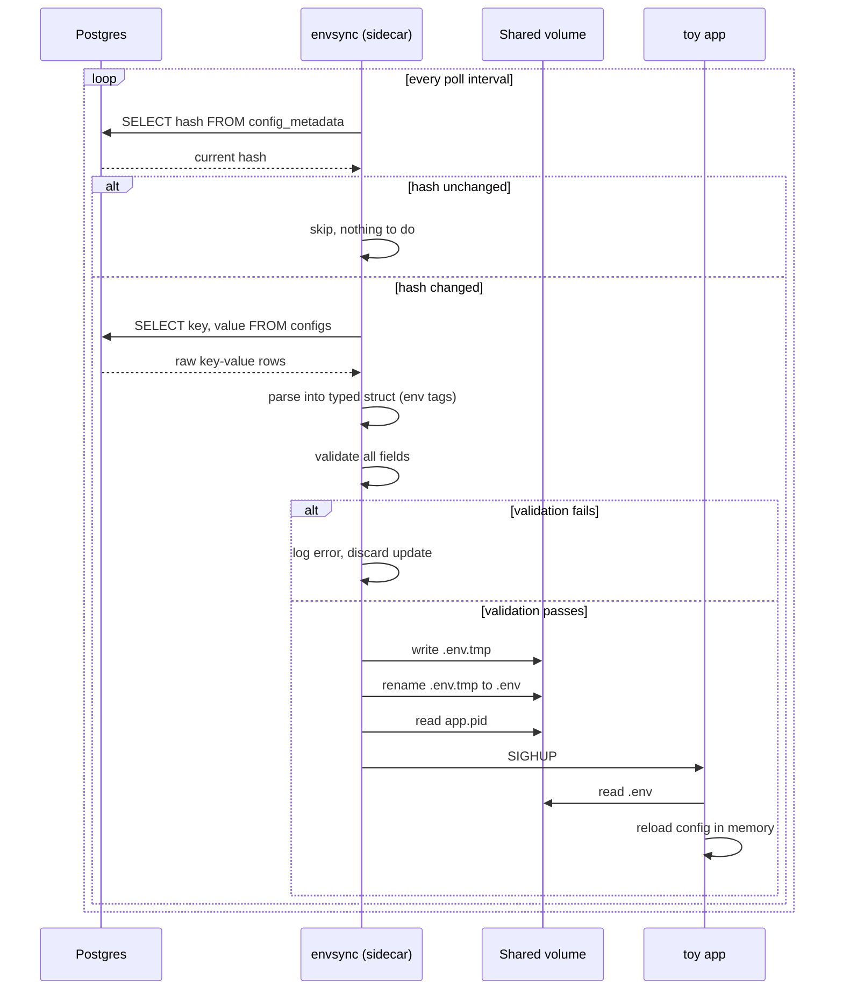

# envsync

It's a small sidecar process that runs alongside an app, watches Postgres for config changes and keep local `.env` file in sync with a signal telling the app to reload. The app doesn't know envsync exists, it only reads a file and reacts to `SIGHUP`

## Architecture

- **Postgres:** source of truth, hash maintained by trigger
- **envsync (sidecar):** polls, validate, writes `.env` + reads `app.pid`, signals the app
- **toy app:** reads `.env` on boot, reloads on `SIGHUP`

Sidecar and app share a PID namespace(`pid: "service:toy"` in compose) so sidecar can deliver the signal across container

## Working



Postgres holds the config as key-value rows in a `configs` table. A trigger recomputes an MD5 hash of the whole config set on every insert/update/delete and stores it in `config_metadata`

Sidecar polls the hash on a fixed interval and when the hash changes

1. Pull the full key-value set from `configs`
2. Parse it into a typed struct over `env` struct tags, adding field to the struct
3. Validate every value like malformed `DB_URL` fails the whole update so the app never sees a half-applied config
4. Write the new config to a temp file and rename it into place
5. Read the app's PID from a file it wrote on startup and send it `SIGHUP`

envsync needs to join toy's PID namespace to send `SIGHUP` which requires the toy container to exist first but the toy app needs `.env` to exist which only happens after envsync starts. These make a sort of cyclic dependency so to handle that, the toy app waits for some duration before trying to load .env

## Limitations

There's no way to pair sidecar#7 with app#7 across N instances with this setup so it stays at one sidecar:one app. An orchestrator like Kubernetes would solve the co-scheduling problem, pairing N sidecars with N app instances natively

## Usage

Start everything

```bash
docker compose up -d --build
```

Update a config value

```bash
./update-config.sh MAX_CONNECTIONS 25
```

Watch logs showing the new value on reload
