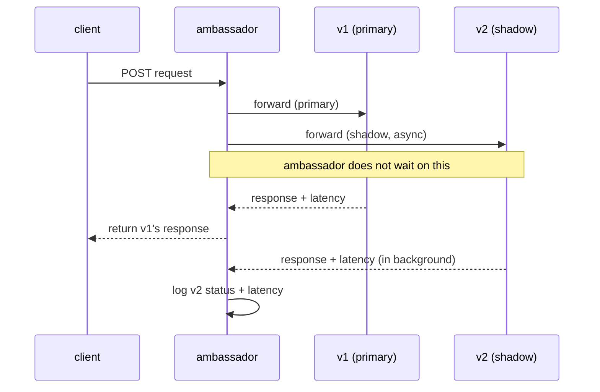

# traffic-shadow

A small proxy that sits between a client and two backend services, v1 (primary) and v2 (shadow). The client only talks to the **ambassador** and only sees v1's response. v2 gets a copy of every request in the background for observation, latency and error rate, the success/failure of which never reached the client

## Architecture

- **client:** it's playing the role of real app would be making these requests. It sends requests to the ambassador on a loop and has no idea of v1/v2 existence
- **ambassador:** intrecepts every request, forwards it to v1 and waits, fires and async copy to v2 and doesn't wait, returns v1's response to client
- **v1(primary):** fast, most reliable mock server
- **v2(shadow):** slower, less reliable server

All four shared one network namespace (`network_mode: "service:ambassador"`) so everything talks over `localhost`

## Working



On every incoming request, the ambassador clones the body and fires two requests:
1. **Primary (v1):** sent synchronously. The ambassador waits for this, times it and returns whatever v1 returns back to client
2. **Shadow (v2):** sent in a goroutine, fire and forget from client's pov. The ambassador waits for it internally

Both request's status codes and latencies feed into a metrics counter, printed every 5 seconds
```
[METRICS] v1 (primary) errors: 4 (10.2%) | avg latency: 32.1ms
[METRICS] v2 (shadow)  errors: 16 (39.8%) | avg latency: 78.4ms
```

## A real world scenario

Say you're rewriting a pricing service, the old one works fine but there's a new version with a different algorithm and you want to know its behavior under real production traffic before trusting

Shadowing solves this. Every real pricing request still gets served by the old, trusted version but the new version gets a live copy of every real request so you can observe it under real traffic with zero risk to customers

**Why not request splitting instead?** A pricing system needs to be uniform, if you split traffic and send, say 10% of customers to the new algorithm and that algorithm turns out to be wrong, a real section of customers just saw a different price than everyone else for the same product

## Usage

Start everything
```bash
docker compose up -d --build
```

Watch the ambassador logs
